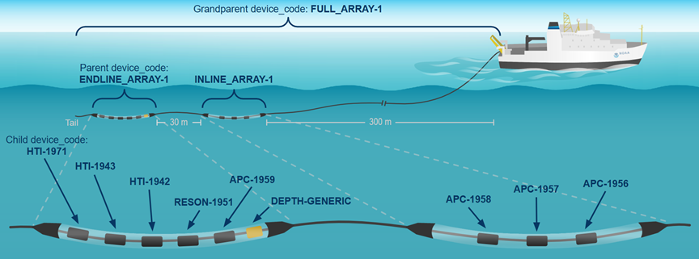

## Example Scenarios

The following scenarios describe potential situations that may arise when submitting data and metadata to Makara. Each scenario is associated with a set of example templates provided in the zipped folder that provide a mockup of what that scenario might look like. Within the template zipped folder is a sub-directory named “examples/”. This sub-directory contains four example folders containing CSV files that are filled out according to each scenario. 

### **Example #1: Single moorings with multiple same recorder types but different settings**

#### Location of example templates within zipped folder: examples/EXAMPLE_1_Moorings_Same_Recorder_Type

This example shows two single, bottom-mounted moorings, each equipped with two SoundTraps, a temperature sensor, and a Vemco receiver. The NS01 mooring was deployed near Nantucket Shoals off the coast of Massachusetts and Rhode Island from October 2021 to February 2022. It had one SoundTrap600 (ST600 STD) and one high-frequency SoundTrap600 (ST600 HF) to record harbor porpoises. Both devices recorded over the whole deployment, but the ST600 HF was duty-cycled, recording for 5 minutes at the beginning of each hour with a sampling rate of 384 kHz. The ST600 STD recorded continuously with a lower sampling rate of 64 kHz. This example also shows what it looks like when there are compromised data in one of the recordings (e.g., a data gap in the recording from the ST600 HF), which can be viewed on the recording_intervals table. Daily presence of North Atlantic right whales was analyzed for 6 days from the ST600 STD recording, and hourly presence of harbor porpoises was analyzed for 6 days from the ST600 HF recording.

The COX01 mooring was deployed near Cox Ledge off the coast of Massachusetts and Rhode Island from November 2021 to February 2022. It had two ST600 HF hydrophones that recorded continuously with a sampling rate of 384 kHz, but one is only on and recording for the first half of the deployment (2021-11-03 to 2022-01-01) and the other is recording for the second half of the deployment (2022-01-01 to 2022-02-24; see the recordings table). Daily presence of North Atlantic right whales and hourly presence of harbor porpoises were analyzed for 6 days from each of the COX01 recordings. Note: More analyses were performed over the whole deployment, but for this example we only showed 6 days worth of analysis.

### **Example #2: Single moorings with multiple different recorder types**

#### Location of example templates within zipped folder: examples/EXAMPLE_2_Moorings_Different_Recorder_Types

This example shows a single, bottom-mounted mooring that was deployed in the offshore Gulf of Maine along the northern edge of Georges Bank from July to December 2022. The mooring was equipped with two hydrophones (one SoundTrap600 with a sampling rate of 64 kHz and one FPOD with a sampling rate of 1,000 kHz to record harbor porpoise), a temperature sensor, and a Vemco receiver. Both devices recorded continuously over the whole deployment, but the FPOD recordings were automatically deleted once they were processed in real-time by a click detector onboard the platform (so only detection data were collected from the FPOD, no audio data). Daily presence of blue whales were analyzed for 6 days from the ST600 STD recording, and hourly presence of harbor porpoises were determined automatically from the detection data for 6 days from the FPOD data. Note: More analyses were performed over the whole deployment, but for this example we only showed 6 days worth of analysis.

### **Example #3: Towed array deployments across multiple cruise legs**

#### Location of example templates within zipped folder: examples/EXAMPLE_3_Towed_Array

This example shows recordings from five towed array deployments across different legs of a research cruise that surveyed offshore of the northeast U.S. in June-August 2016. The towed array setup consisted of two separate oil-filled arrays (an inline and an endline array), each containing multiple hydrophones and one containing a depth sensor. There were different types of hydrophones (e.g., APC, Reson, HTI), all of which recorded continuously whenever the array was deployed. Some had a sampling rate of 192 kHz while others had a sampling rate of 500 kHz to record Kogia clicks.

All of the 192 kHz recordings were post-processed and analyzed for the clicks of various beaked whale species including Blainville's, goose-beaked, Gervais', unidentified True's/Gervais', Sowerby's, True's, and unidentified Mesoplodon. Three of the 500 kHz recordings from deployments NEFSC_HB1603_DEP1, DEP3, and DEP4 were post-processed and analyzed for unidentified pygmy/dwarf sperm whales. The 192 kHz recording from deployment NEFSC_HB1603_DEP3 was also analyzed in real-time onboard the ship for presence of Blainville's beaked whales, bottlenose dolphins, unidentified common dolphins, goose-beaked beaked whales, Gervais' beaked whales, unidentified Risso's/bottlenose dolphins, unidentified True's/Gervais', unidentified pilot whales, pantropical spotted dolphins, Sowerby's beaked whales, sperm whales, striped dolphins, True's beaked whales, and unidentified dolphins.

{fig-alt="Towed array diagram, hydrophones"}

### **Example #4: Glider deployment**

#### Location of example templates within zipped folder: examples/EXAMPLE_4_Gliders

This example shows an autonomous Slocum glider that was deployed near Cox Ledge off the coast of Massachusetts and Rhode Island from October 2022 to December 2023. The glider was equipped with a second generation Digital Acoustic Monitoring instrument (DMON2) and a Vemco receiver. The DMON2 was recording continuously throughout the deployment with a sampling rate of 2 kHz. Subsampled periods of simplified spectrograms (without the acoustic recordings) were transmitted to shore via satellite every 2 hours, and then analyzed for presence of sei, fin, humpback, and North Atlantic right whales in near-real time . The full audio recordings were collected when the glider and hard drive were retrieved.
