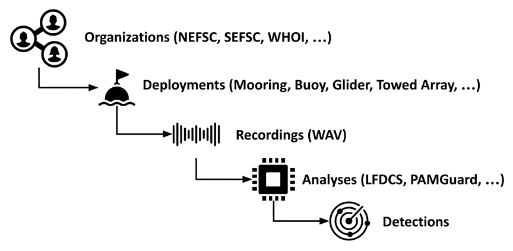

## Primary Data Tables

The following tables are the primary tables for any data submission. Together, these four tables represent the core data stored in Makara. However, they are not strictly required for every submission. For example, a submission could contain only deployments but no recordings, analyses or detections, which could be added in a later submission. For each table, the data only needs to be submitted once unless updates or corrections are needed. In those cases, a revised table may be submitted so long as there are no changes in the primary codes identifying each row (e.g., deployment_code, recording_code, etc.).

|  |  |  |
|----|----|----|
| **Data Table** | **Definition** | **When to Submit** |
| **Deployments** | The use of a platform (e.g., bottom-mounted mooring, buoy, glider, towed array) to record audio over a period of time | After a deployment has ended (the start date/time of a deployment is a required field, so a partial table could be submitted once a recorder is in the water, but would need to be updated after retrieval) |
| **Recordings** | Single or multichannel recordings that were made over the course of one or more deployments | After a deployment has ended |
| **Analyses** | The metadata needed to understand the detection results (i.e., the parameters of the analysis protocol) | After the data have been analyzed (if applicable, at the same time as the Detections table) |
| **Detections** | A time-binned or event-based identification of a sound source (e.g., dolphin, Atlantic cod, humpback whale, rain, vessel) produced from a passive acoustic detector or manual analysis that is used to determine presence of the sound source | After a recording has been analyzed (if applicable) |

{fig-alt="Diagram: Relationships:  Organizations, Deployments, Recordings, Analyses, Detections"}
